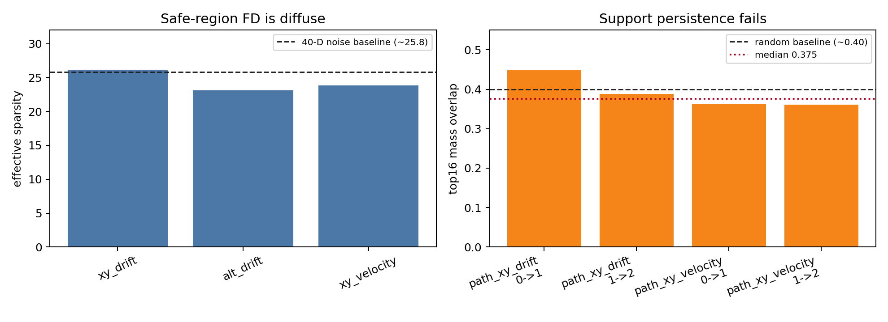
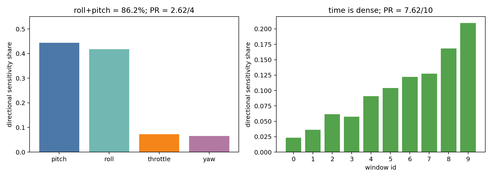
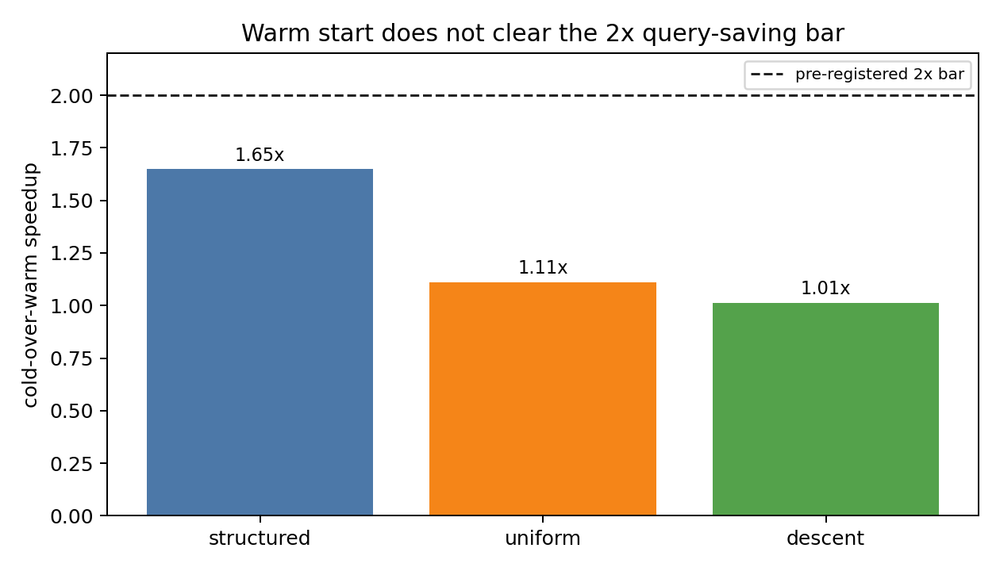
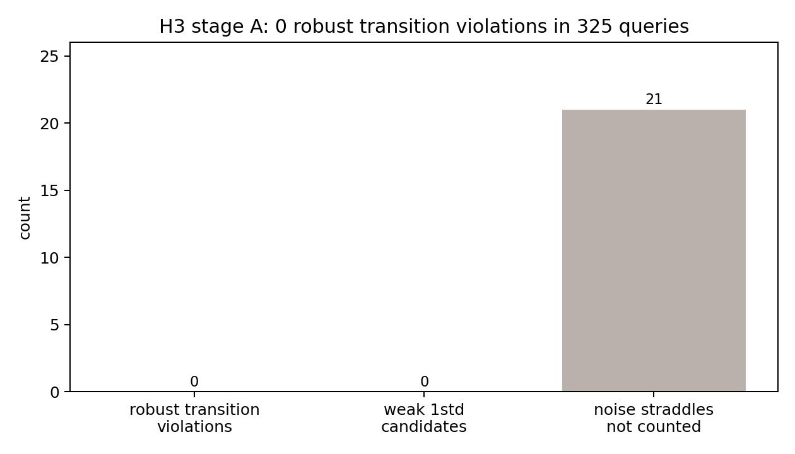
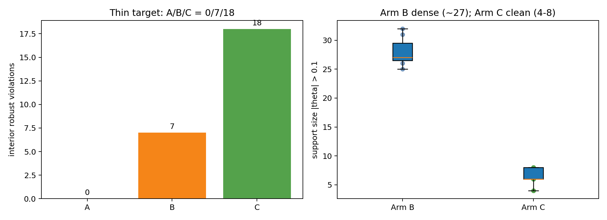
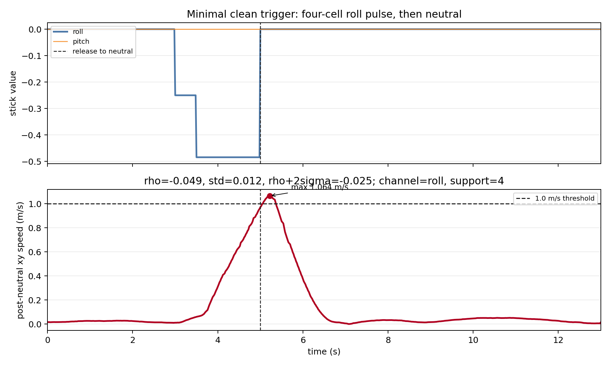
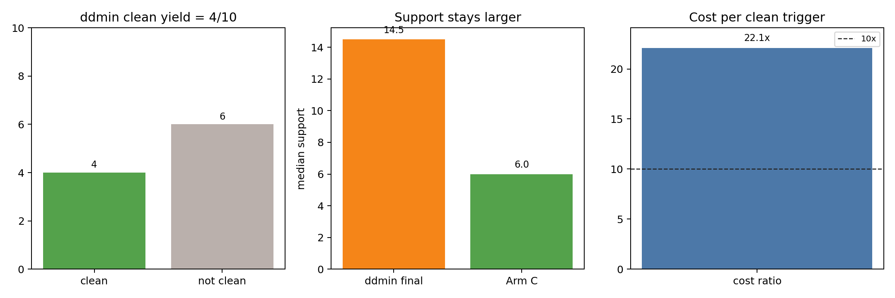

# CADET Result Artifacts

This directory freezes the current seed-0 CADET result checkpoint: small
CSV/JSON/theta artifacts plus document-ready figures generated from those
small artifacts. Raw simulator logs remain excluded under `runs/`.

Global caveat: **PX4 px4_position（POSCTL）seed-0 单种子/单场景探针；多种子、第二属性、ArduPilot 复现为投稿前必做。**

## Safe Region Is a Plateau; Persistence Fails

Claim: safe-region finite differences are diffuse/noise-like, and the measured
support is not persistent enough to guide a sparse global search.

Caveat: **PX4 px4_position（POSCTL）seed-0 单种子/单场景探针；多种子、第二属性、ArduPilot 复现为投稿前必做。**

Key numbers:

- Effective sparsity for PX4 position J=5 denoise: `26.08`, `23.09`, `23.84`
  across the three post-neutral properties; this sits near the 40-D pure-noise
  reference level of about `25`.
- Persistence median top16 mass overlap: `0.375410262484114`, near the random
  baseline cited in the narrative.
- Source run: `runs/archive/rq1_zero_theta_sph_rejected/legacy_rq1_minimal_v0`.
- Runner lineage: `cadet.runners.repeated_fd` and `cadet.runners.persistence_pilot`.
- Supports paper narrative §3.1 / SPH negative result.

Gap: the prose number `noise≈282×step` is not present as a named field in the
local small artifacts found during this curation pass. The archived CSVs keep
the underlying `estimated_noise_l1_before/after` values, but this checkpoint
does not promote the 282x ratio as a curated headline until provenance is found.

## Boundary Channel Anisotropy

Claim: once measured at the δ=0.2 redo boundary point, sensitivity is sparse in
channels but dense in time.

Caveat: **PX4 px4_position（POSCTL）seed-0 单种子/单场景探针；多种子、第二属性、ArduPilot 复现为投稿前必做。**

Key numbers:

- roll+pitch sensitivity share: `0.8622562334993128`.
- Channel participation ratio: `2.6205793568791225 / 4`.
- Window participation ratio: `7.618880107165337 / 10`.
- Source run: `runs/margin_stage1_redo_v1`.
- Runner: `cadet.runners.margin_stage1_redo`.
- Supports paper narrative §3.2 / H1.

## H2 Warm Start Does Not Save Queries

Claim: cross-condition warm starts preserve some local structure but do not
produce the required query savings.

Caveat: **PX4 px4_position（POSCTL）seed-0 单种子/单场景探针；多种子、第二属性、ArduPilot 复现为投稿前必做。**

Key numbers:

- Cold-over-warm speedups: `1.0132450331125828`, `1.111842105263158`,
  `1.6486486486486487`; all below the 2x bar.
- Source run: `runs/route1_h2_px4_position_seed0_vmax_pilot_v0`.
- Runner: `cadet.runners.route1_h2_campaign`.
- Supports paper narrative §4.2 / H2 negative result.

## H3 Transition Handoff Is Clean

Claim: the POSCTL-to-AUTO.LOITER transition handoff produced no robust
transition-specific violation in this probe.

Caveat: **PX4 px4_position（POSCTL）seed-0 单种子/单场景探针；多种子、第二属性、ArduPilot 复现为投稿前必做。** H3 uses `px4_transition`, but it is still a seed-0 PX4
probe.

Key numbers:

- Robust transition violation count: `0`.
- Distinct robust cluster count: `0`.
- Stage-A query count: `325`.
- Source run: `runs/h3_transition_seed0_v1`.
- Runner: `cadet.runners.h3_transition`.
- Supports paper narrative §4.3 / H3 negative result.

## RQ1 Thin Target / Three Arms

Claim: the target is thin and channel-directed search exposes clean triggers
that random and channel-agnostic probing miss or reach only densely.

Caveat: **PX4 px4_position（POSCTL）seed-0 单种子/单场景探针；多种子、第二属性、ArduPilot 复现为投稿前必做。**

Key numbers:

- Interior robust violations A/B/C: `0 / 7 / 18`.
- Arm B interior supports are dense, centered around about `27`.
- Arm C interior supports are clean and small, `4-8`.
- Source run: `runs/direction_a_px4_position_seed0_v0`.
- Runner: `cadet.runners.direction_a_probe`.
- Supports paper narrative §5.1 / RQ1.

Minimal trigger example:

This is Arm C `eval_id=196`, theta hash `9dfde040ab231b58`: a four-cell roll
pulse ending at neutral. The archived repeat shown crosses the `1.0 m/s`
post-neutral xy-speed threshold; the J=5 robust summary is
`rho_mean=-0.0488912449450468`, `rho_std=0.0117186427878129`, so
`rho+2sigma=-0.025453959369420998`.

## RQ2 ddmin Necessity Baseline

Claim: post-hoc channel-agnostic delta debugging cannot match the channel-
directed trigger synthesis in this seed-0 probe.

Caveat: **PX4 px4_position（POSCTL）seed-0 单种子/单场景探针；多种子、第二属性、ArduPilot 复现为投稿前必做。**

Key numbers:

- Clean minimized triggers: `4 / 10`.
- Final support median: `14.5`, versus Arm C median `6.0`.
- Cost ratio per clean trigger: `22.10625`.
- Source run: `runs/direction_a_ddmin_px4_position_seed0_v1`.
- Runner: `cadet.runners.direction_a_ddmin`.
- Supports paper narrative §5.2 / RQ2.

## Include / Exclude / Gap Register

INCLUDE:

- `runs/archive/rq1_zero_theta_sph_rejected/legacy_rq1_minimal_v0` SPH J=5
  denoise and persistence reports only.
- `runs/margin_stage1_redo_v1`.
- `runs/route1_h2_px4_position_seed0_vmax_pilot_v0`.
- `runs/h3_transition_seed0_v1`.
- `runs/direction_a_px4_position_seed0_v0`.
- `runs/direction_a_ddmin_px4_position_seed0_v1`.

EXCLUDE:

- `runs/margin_stage1_v1` and `runs/margin_stage1_v1_d05996_probe`: replaced by
  the δ=0.2 redo.
- `runs/direction_a_ddmin_px4_position_seed0_v0`: incomplete/no canonical
  summary, replaced by v1.
- `runs/h3_transition_seed0_v0`: earlier H3 stage0-focused run, replaced by v1.
- `runs/margin_stage0_v1`: support/anchor run, not a quoted claim result here.
- `runs/rq1_boundary_v0`, `runs/phase0_metrics`, `runs/synthetic_sanity_v0`:
  outside this checkpoint's claim table.
- `runs/archive` content outside the SPH J=5 denoise/persistence subtree.

Current gaps:

- No contradiction was found between the curated canonical runs and the quoted
  narrative numbers.
- The `noise≈282×step` ratio lacks direct small-artifact provenance in the
  local run tree and should be confirmed before paper use.

All figures in this index were generated from the curated small artifacts by
`scripts/curate_results_checkpoint.py`; no simulator experiment was run.
