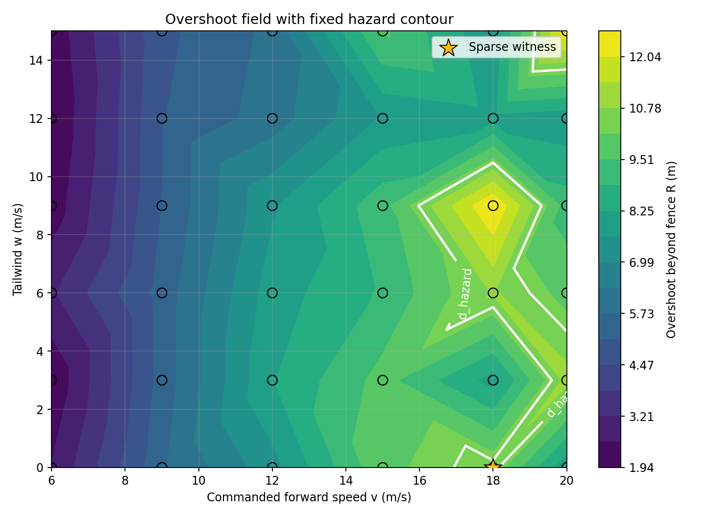
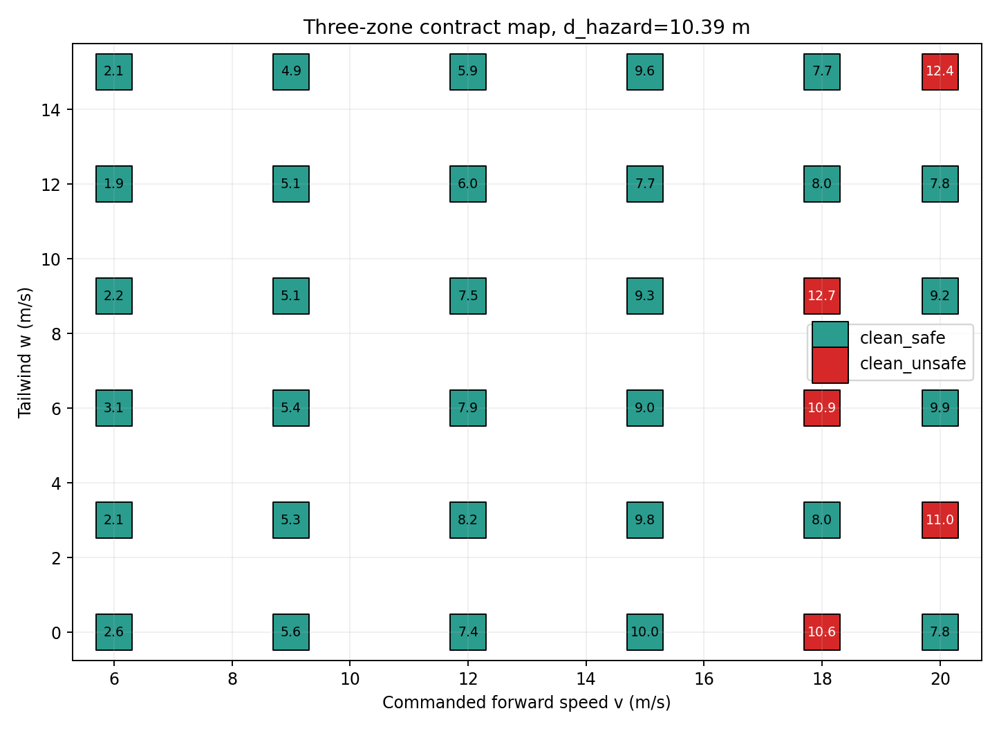
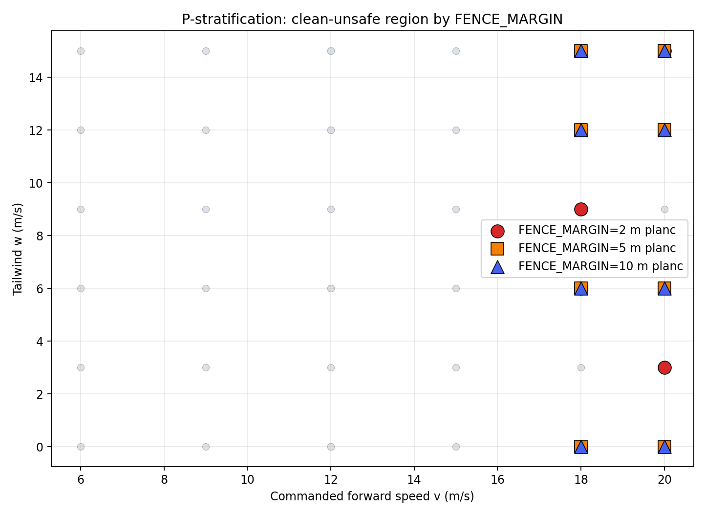
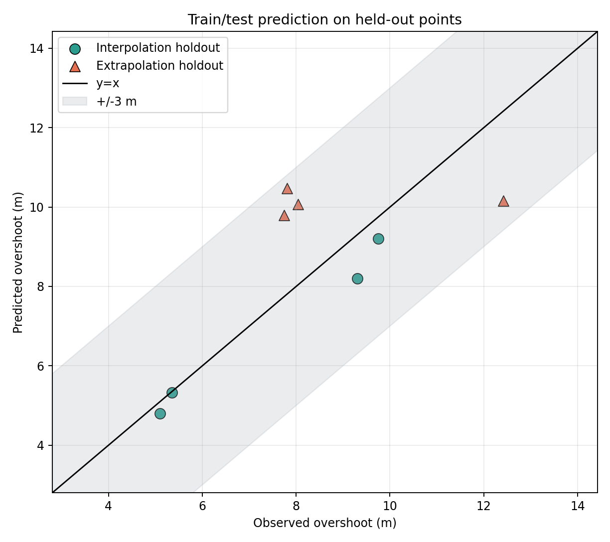

# planc gradient report: geofence overshoot method machine

## Purpose

This extends the passed v2 gate from a single constructed witness into a reusable method machine on a ground-truth geofence scenario: scan M x E, measure an overshoot field, label contract status, select a sparse witness, stratify P, and test whether a fitted rule predicts held-out conditions. The known physics is the validation target: the method should recover a smooth boundary before it is used on less obvious headline scenarios.

## Design

Fixed fence radius R=100.00 m. A reference run at v_ref=12.00 m/s and no wind measured overshoot_ref=7.39 m. The fixed hazard distance is d_hazard=overshoot_ref+buffer=10.39 m with buffer=3.00 m, so hard_boundary=R+d_hazard=110.39 m.

The field value is always the measured `overshoot=max_distance-R`; unsafe is only the overlay `overshoot > d_hazard`. Contract labels reuse the v2 DataFlash oracle and now record the full `ERR`, `EV`, fence message, STATUSTEXT, and mode-change spectrum. Dirty points are recorded as `contract_violated` and excluded from planc.

M is commanded GUIDED local-NED forward speed. E is tailwind with `SIM_WIND_TURB=0`. `WPNAV_SPEED=3000 cm/s`, `WPNAV_ACCEL=1000 cm/s^2`, `WPNAV_JERK=20 m/s^3`, and `ANGLE_MAX=6000 cdeg` keep the commanded-speed limits above the 20 m/s grid maximum. `AVOID_ENABLE=1` keeps stop-at-fence active, which is the mechanism path for `FENCE_MARGIN`; each run audits XKF1 VN/VE forward speed from the log so any mechanism-induced speed reduction is visible.

## Figures

- overshoot_heatmap: 
- three_zone: 
- p_stratification: 
- train_test: 

## Default grid

Zone counts on FENCE_MARGIN=2 m: clean_safe=31, clean_unsafe/planc=5, contract_violated=0, blocked=0.
Contract gap note: Need at least one clean_unsafe and one contract_violated point on the same grid

| v m/s | w m/s | overshoot mean m | std m | label | speed audit p95 err m/s | runs |
| ---: | ---: | ---: | ---: | --- | ---: | --- |
| 6 | 0 | 2.61 | 0.00 | clean_safe | 0.04 | grad_m02_v06_w00_r1 |
| 6 | 3 | 2.06 | 0.00 | clean_safe | 0.01 | grad_m02_v06_w03_r1 |
| 6 | 6 | 3.11 | 0.00 | clean_safe | 0.02 | grad_m02_v06_w06_r1 |
| 6 | 9 | 2.19 | 0.00 | clean_safe | 0.01 | grad_m02_v06_w09_r1 |
| 6 | 12 | 1.94 | 0.00 | clean_safe | 0.01 | grad_m02_v06_w12_r1 |
| 6 | 15 | 2.14 | 0.00 | clean_safe | 0.03 | grad_m02_v06_w15_r1 |
| 9 | 0 | 5.60 | 0.00 | clean_safe | 0.28 | grad_m02_v09_w00_r1 |
| 9 | 3 | 5.35 | 0.00 | clean_safe | 0.21 | grad_m02_v09_w03_r1 |
| 9 | 6 | 5.36 | 0.00 | clean_safe | 0.17 | grad_m02_v09_w06_r1 |
| 9 | 9 | 5.10 | 0.00 | clean_safe | 0.18 | grad_m02_v09_w09_r1 |
| 9 | 12 | 5.07 | 0.00 | clean_safe | 0.20 | grad_m02_v09_w12_r1 |
| 9 | 15 | 4.93 | 0.00 | clean_safe | 0.25 | grad_m02_v09_w15_r1 |
| 12 | 0 | 7.39 | 0.00 | clean_safe | -0.25 | grad_m02_v12_w00_r1 |
| 12 | 3 | 8.22 | 1.24 | clean_safe | -0.38 | grad_m02_v12_w03_r1, grad_m02_v12_w03_r2, grad_m02_v12_w03_r3 |
| 12 | 6 | 7.94 | 0.00 | clean_safe | -0.44 | grad_m02_v12_w06_r1 |
| 12 | 9 | 7.54 | 1.29 | clean_safe | -0.48 | grad_m02_v12_w09_r1, grad_m02_v12_w09_r2, grad_m02_v12_w09_r3 |
| 12 | 12 | 6.03 | 0.00 | clean_safe | -0.39 | grad_m02_v12_w12_r1 |
| 12 | 15 | 5.88 | 0.00 | clean_safe | -0.34 | grad_m02_v12_w15_r1 |
| 15 | 0 | 10.01 | 0.69 | clean_safe | -3.15 | grad_m02_v15_w00_r1, grad_m02_v15_w00_r2, grad_m02_v15_w00_r3 |
| 15 | 3 | 9.75 | 0.22 | clean_safe | -3.23 | grad_m02_v15_w03_r1, grad_m02_v15_w03_r2, grad_m02_v15_w03_r3 |
| 15 | 6 | 8.98 | 0.70 | clean_safe | -3.25 | grad_m02_v15_w06_r1, grad_m02_v15_w06_r2, grad_m02_v15_w06_r3 |
| 15 | 9 | 9.30 | 1.11 | clean_safe | -3.27 | grad_m02_v15_w09_r1, grad_m02_v15_w09_r2, grad_m02_v15_w09_r3 |
| 15 | 12 | 7.69 | 0.00 | clean_safe | -3.29 | grad_m02_v15_w12_r1 |
| 15 | 15 | 9.63 | 0.63 | clean_safe | -3.27 | grad_m02_v15_w15_r1, grad_m02_v15_w15_r2, grad_m02_v15_w15_r3 |
| 18 | 0 | 10.60 | 1.51 | clean_unsafe | -6.12 | grad_m02_v18_w00_r1, grad_m02_v18_w00_r2, grad_m02_v18_w00_r3 |
| 18 | 3 | 8.00 | 0.00 | clean_safe | -6.13 | grad_m02_v18_w03_r1 |
| 18 | 6 | 10.86 | 0.98 | clean_unsafe | -6.23 | grad_m02_v18_w06_r1, grad_m02_v18_w06_r2, grad_m02_v18_w06_r3 |
| 18 | 9 | 12.67 | 0.00 | clean_unsafe | -6.28 | grad_m02_v18_w09_r1 |
| 18 | 12 | 8.04 | 0.00 | clean_safe | -6.24 | grad_m02_v18_w12_r1 |
| 18 | 15 | 7.74 | 0.00 | clean_safe | -6.27 | grad_m02_v18_w15_r1 |
| 20 | 0 | 7.76 | 0.00 | clean_safe | -7.97 | grad_m02_v20_w00_r1 |
| 20 | 3 | 10.99 | 0.80 | clean_unsafe | -8.04 | grad_m02_v20_w03_r1, grad_m02_v20_w03_r2, grad_m02_v20_w03_r3 |
| 20 | 6 | 9.92 | 0.22 | clean_safe | -8.11 | grad_m02_v20_w06_r1, grad_m02_v20_w06_r2, grad_m02_v20_w06_r3 |
| 20 | 9 | 9.20 | 1.62 | clean_safe | -8.16 | grad_m02_v20_w09_r1, grad_m02_v20_w09_r2, grad_m02_v20_w09_r3 |
| 20 | 12 | 7.81 | 0.00 | clean_safe | -8.20 | grad_m02_v20_w12_r1 |
| 20 | 15 | 12.42 | 0.71 | clean_unsafe | -8.18 | grad_m02_v20_w15_r1, grad_m02_v20_w15_r2, grad_m02_v20_w15_r3 |

## Sparse minimum witness

The least-aggressive planc point by `v/max(v_grid)+w/max(w_grid)` is v=18 m/s, w=0 m/s, overshoot=10.60 m, label=clean_unsafe, score=0.900.
This is the prototype objective `minimize aggressiveness(v,w) subject to clean_unsafe`; richer sparse regularized search over a higher-dimensional M space is intentionally deferred to (b).

## P stratification

| FENCE_MARGIN m | run grid points | common 4x4 clean_unsafe | common 4x4 clean_safe | common 4x4 contract_violated | full/layer clean_unsafe |
| ---: | ---: | ---: | ---: | ---: | ---: |
| 2 | 36 | 3 | 13 | 0 | 5 |
| 5 | 16 | 8 | 4 | 4 | 8 |
| 10 | 16 | 8 | 4 | 4 | 8 |

On the common coarse grid, the clean-unsafe set did not shrink as FENCE_MARGIN grew (default count 3; layer counts [('2', 3), ('5', 8), ('10', 8)]). Low-speed points became contract_violated because stop-at-fence held them inside the fence, but high-speed points remained or became clean-unsafe. This is a mechanism-related finding, not the expected shrinkage result.
Only P changes across these layers: the commanded-speed/tailwind values on the common 4x4 grid are held fixed, and `FENCE_MARGIN` is the mechanism knob for predicted braking margin.

## Predictive rule

Formula: `overshoot ~= beta0 + beta_v*v + beta_w*w + beta_vw*v*w + beta_v2*v^2`.
Full-grid coefficients: beta0=-4.9123, beta_v=1.5533, beta_w=-0.1189, beta_vw=0.0054, beta_v2=-0.0408.
Full-grid residuals: MAE=0.82 m, RMSE=1.12 m.
interpolation: n=4, MAE=0.49 m, RMSE=0.63 m, decision accuracy=1.000.
extrapolation: n=4, MAE=2.26 m, RMSE=2.27 m, decision accuracy=0.500.

Method-vs-characterization conclusion: At least one holdout split had large error or decision mismatch. The measured field is reported as a characterization here rather than a reliably smooth predictive rule.

## d_hazard sensitivity

| delta m | d_hazard m | clean unsafe count | fraction of clean grid |
| ---: | ---: | ---: | ---: |
| -6 | 4.39 | 30 | 0.833 |
| -3 | 7.39 | 21 | 0.583 |
| 0 | 10.39 | 5 | 0.139 |
| 3 | 13.39 | 0 | 0.000 |
| 6 | 16.39 | 0 | 0.000 |

This sensitivity is computed after calibration; the reported d_hazard is not tuned to enlarge the planc region.

## Reproducibility and jitter

Near-contour repeated points: 13. Max repeated overshoot spread=3.70 m. Mean command-stream std(dt)=0.0106 s.
Repeated near-contour runs had stable 10 Hz send timing; observed overshoot spread is not explained by large command-stream timing jitter in this run set.
Speed audit note: these points did not reach commanded speed within tolerance by p95 and should be interpreted with that caveat. In this scenario the dominant source is the legal stop-at-fence avoidance path used by `FENCE_MARGIN`, not a low `WPNAV_SPEED` setting: m2_v15_w0, m2_v15_w3, m2_v15_w6, m2_v15_w9, m2_v15_w12, m2_v15_w15, m2_v18_w0, m2_v18_w3, m2_v18_w6, m2_v18_w9, m2_v18_w12, m2_v18_w15, m2_v20_w0, m2_v20_w3, m2_v20_w6, m2_v20_w9, m2_v20_w12, m2_v20_w15.

## Limitations

The geofence physics are intuitive by design; that is a validation advantage, not a weakness. SITL fidelity is limited, the external hazard boundary is constructed from reference behavior, and this M space is deliberately two-dimensional. The richer sparse-search problem belongs to the next headline scenario.

## What this step validates

On a known ground-truth scenario, the pipeline recovers an overshoot gradient, separates planc clean-unsafe points from contract violations, checks P dependence, and tests predictive held-out conditions. In this run, interpolation was predictive, but extrapolation and the expected P shrinkage were not clean passes; that is the honest output of the method machine before moving to (b).
